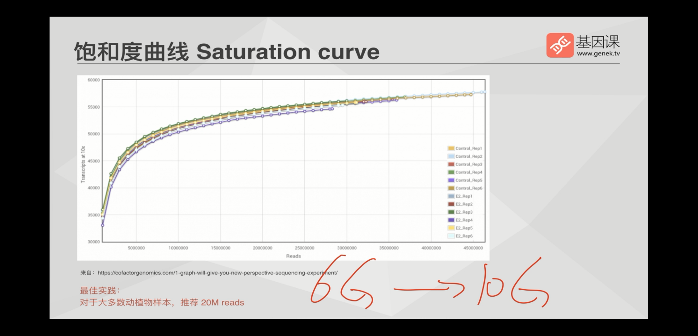
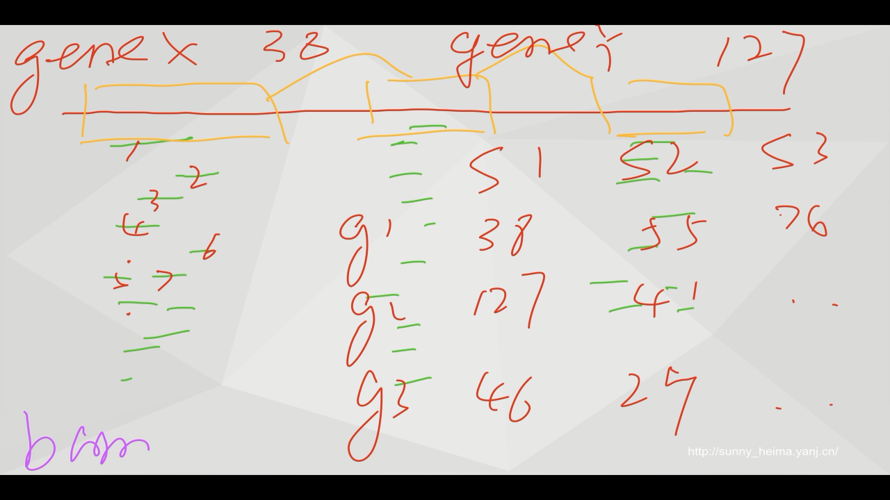
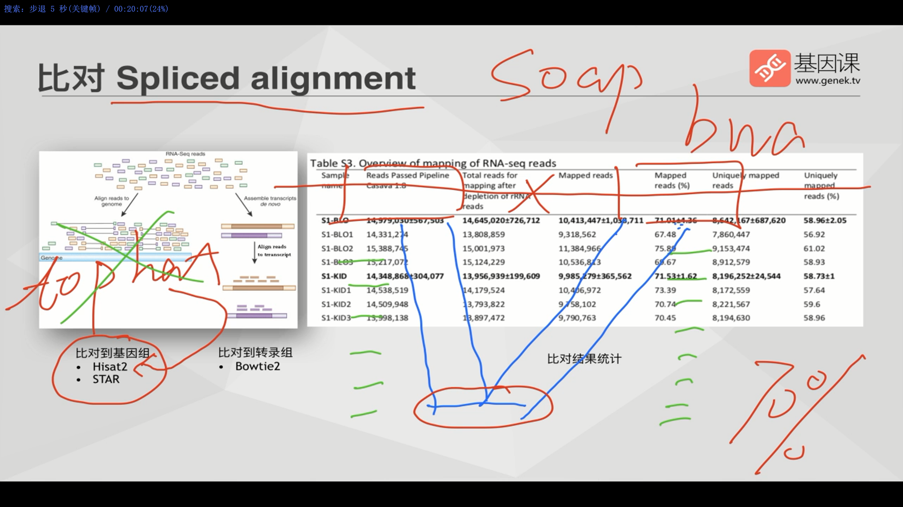
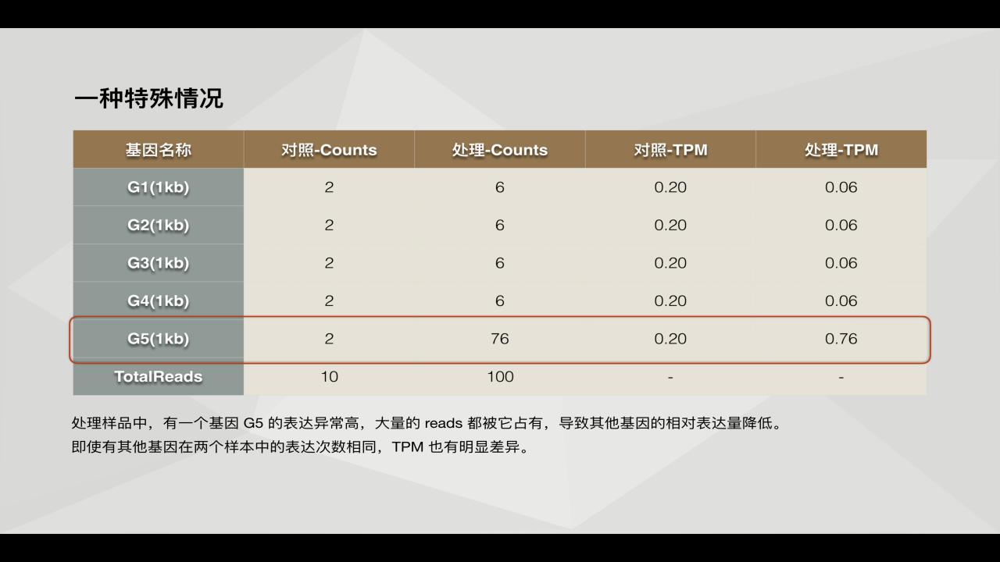

转录组分析流程
---

思维导图：

[]

# 1. 测序数据的处理

表达芯片（前期较早）

RNA-seq（目前基本使用这个来做分析，几乎替代表达芯片）

## 1.1. 数据量问题

测序一般多少较为合适？
6G --> 10G 的数据量（碱基量bp）

6G一般够了，双末端测序一般就有20M的reads数据。

> 对应使用PE测序(双末端测序)的reads数目为20M。  
> 如何计算？  
> 双末端测序的数目150bp*2=300bp，而SE(单末端测序)是150bp  
> 20 M * 300 = 6G  

如图：
  

# 2. 比对
使用 `RNA-seq数据` 比对到 `参考基因组`

## 2.1. 比对到基因组

- 比对算法：Spliced alignment
- 算法特征：算法允许比对时从中间截断，分别比对到基因组。【疑惑，是reads被截断分别比对到基因组的不同位置？？】
- 软件选择：
  - `Hisat2`，综合效能最好，速度大大提升，内存消耗更低，效果仅次于STAR但区别不大。
  - `STAR`，比对效果最好，但更消耗计算资源（运行更久，内存消耗更多）。
  - 其他说明：
    - 早期：早期华大等公司在用soap、bwa等，现在基本作废，因为他们未切分比对，不要使用他们作转录组。
    - 后来：tophat的作者声明不要再用tophat，要使用Hisat2（Hisat的第二个版本）。`TopHat + Cufflinks` 软件后来被作者升级为 `Hisat2 + Stringtie`。 `Stringtie`可以进行转录本拼接并预测延伸基因片段以及计算表达量，但一个分析结果并不足以说明延伸基因结构的准确性，需要验证与证明（可能是实验）。
- 结果解读：
  - 比对率 Mapped reads(%)，对于大多数动植物而言，基因组做的不差的前提下，比对率 ***在70%以上*** 较为合理。

图示：
  
  

## 2.2. 比对到转录组

***慎用！！***

【真核生物有可变剪切，而原核生物没有？】

局限性：
- 一般就比对到参考基因组上，通过比对到基因组有可能发现新基因，研究融合基因，可变剪切。
- 而比对到转录组，则会遗失一些基因，方法比较受限。

软件：`bowtie2`

  

## 2.3. 不比对：无参转录组

不推荐做，问题在于会拼接出大量的转录本，意义不大。【如何理解？】

# 3. 定量

**表达定量：** 统计比对落在基因上的reads条数，以此作为表达量计算依据。

**问题一：如何分配多处比对的reads？**（一条read比对到多条基因如何处理？）
- 假如仅有 5% 左右reads 比对到两个及以上基因，影响不大。【可以去除？】
- 假如有一半的reads出现了这种情况，这个转录组项目基本可以不用做了。可以考虑三代转录组进行定量，但当下(2020年)技术尚不成熟且成本高。

延伸问题：重复序列造成的这种问题怎么处理？
  - 处理过程：第一代直接使用uniq丢掉了；第二代直接分别加半票；第三代采用机器学习算法（如贝叶斯等），计算统计可能的概率，给不同基因分别加分(如 gene1 0.3, gene2 0.7)。【具体是指什么软件？没太明白】

**问题二：在基因层次还是isoform层次定量？**
- 两个基本概念：
  - 基因层次：一个基因内的所有外显子。
  - isoform层次：可变剪切的不同转录本。

如：基因层次12次，第一套 isoform 为8次，第二套 isoform 为4次。

- 如何选择：
  - 一般而言，如果研究不是特别深入的话，一般就基因层次就足够了。
  - 当多种不同 isoform 的序列类似，是很难用 isoform层次 来进行定量的。尽量不要折腾 isoform层次 的定量，尽量做基因层次定量。

当出现参考基因组与已知参考基因组的差别较大时，如何解决？
比如同一个属的不同物种一般是不能用的，但比对率还可以也是可以用的。同一个物种的不同亚种是可以用的。还有就是看比对率，如果高于70%，那么也是有可可能能用基因组的。

如图：
  

## 3.1. 软件选择：
- 基于比对率（较为常用，大多数文章需要提到比对率）
  - `htseq`软件包里的`htseq-count`命令 (老软件)
  - `Subread`软件包里的`featureCount`命令 (新软件2014，推荐)
- 基于k-mer频率（较新）
  - `salmon`
  - ...

更多：[转录本定量（二代、三代）——salmon、stringtie - becky_gogogo - 博客园](https://www.cnblogs.com/beckygogogo/p/9849335.html)

# 4. 标准化
问题背景描述：
> 通过`featureCount`获得的`ReadsCount`矩阵数据不能直接进行基因间表达量多少的比较，它们的比较受基因长度不同、测序深度不同所影响。  
> 比如说，一个很长的基因有一点表达，而一个很短的基因全部表达。是不能直接进行数量上的比较的。而测序深度的不同，也会导致直接比较出错。

图示：
  

## 4.1. 标准化方法

1. RPKM/FPKM(单末端/双末端)，后来被证明是错的，详情见：【待补充】。
2. TPM

标准化方法原理：【待补充】

  

  

