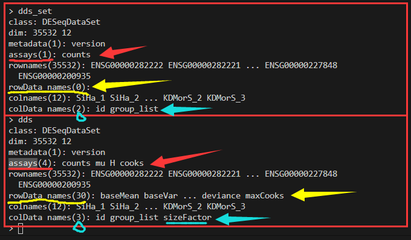

# DESeq2

预热：
```R
library(DESeq2)
#准备count tables
cnts <- matrix(rnbinom(n=1000, mu=100, size=1/0.5),ncol = 10) #构建满足随机负二项分布的一组数
cond <- factor(rep(1:2,each=5))

#创建DEseqDataSet
dds <- DESeqDataSetFromMatrix(cnts,DataFrame(cond), ~cond)

#标准分析
dds <- DESeq(dds)
res <- results(dds)
##另一种检验，LRT，似然率检验
#ddsLRT <- DESeq(dds,test="LRT",reduced=~1)
#resLRT <- results(ddsLRT)

#moderate lfc
resultsNames(dds)
resLFC <- lfcShrink(dds,coef = 2,type = "apeglm")

#提取结果
summary()
subset()
```

## 代码示例

```R

```

## 内容理解

对于DESeq2的前后数据对比理解？

  


## 案发现场

这样一个基因为什么不被筛选进入差异基因？

---

原始表达矩阵：
```shell
$ cat all.id.xls|grep ENSG00000113013
ENSG00000113013 9080    7604    8741    19952   21831   22851
```
DESeq2计算结果：
```bash
> RES["ENSG00000113013",]
                baseMean log2FoldChange      lfcSE     stat     pvalue
ENSG00000113013 14416.04       1.120379 0.07072108 1.702159 0.08872548
                     padj
ENSG00000113013 0.2758274
```

