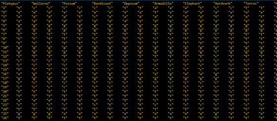
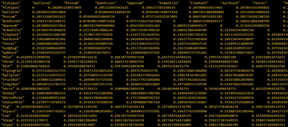

# 1. 官网简介
官方文档：
- https://cran.r-project.org/web/packages/phangorn/phangorn.pdf

phangorn package | R Documentation
- https://www.rdocumentation.org/packages/phangorn/versions/2.5.5

# 2. 包函数研究
## 2.1. NJ()

文档：https://www.rdocumentation.org/packages/phangorn/versions/2.5.5/topics/NJ

函数用途：

- 测试：
```R
library('phangorn')

data(Laurasiatherian)
dm <- dist.ml(Laurasiatherian)
tree <- NJ(dm)
plot(tree)

write.table(Laurasiatherian, "test1.txt", sep="\t")
write.table(as.matrix(dm),'test2.txt',sep="\t")
```

结果数据预览：

`test1.txt`:
  

`test2.txt`:
  

- other
<!-- 植物进化-生信-王悦玲 15:33:59 -->
```R
set.seed(3)
data(Laurasiatherian)
dm <- dist.hamming(Laurasiatherian)
tree <- NJ(dm)
parsimony(tree, Laurasiatherian)
treeRA <- random.addition(Laurasiatherian)
treeNNI <- optim.parsimony(tree, Laurasiatherian)
treeRatchet <- pratchet(Laurasiatherian, start=tree, maxit=100,
minit=5, k=5, trace=0)
# assign edge length
treeRatchet <- acctran(treeRatchet, Laurasiatherian)
plot(midpoint(treeRatchet))
add.scale.bar(0,0, length=100)
parsimony(c(tree,treeNNI, treeRatchet), Laurasiatherian)
```
