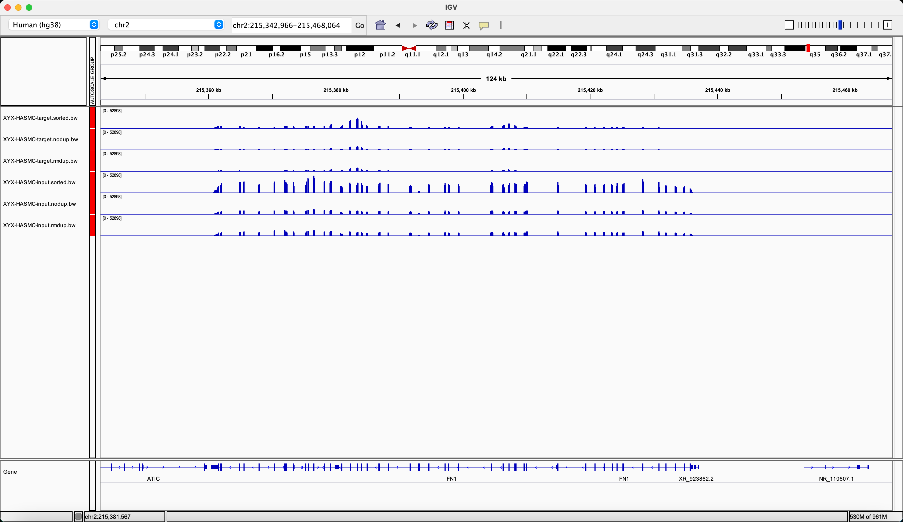
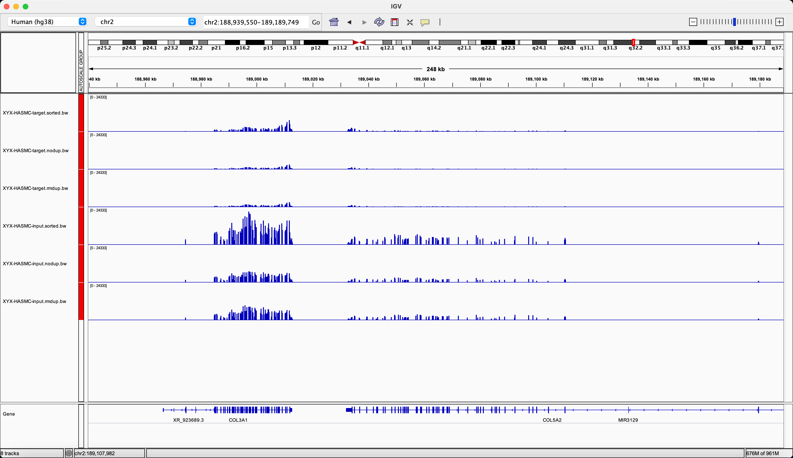
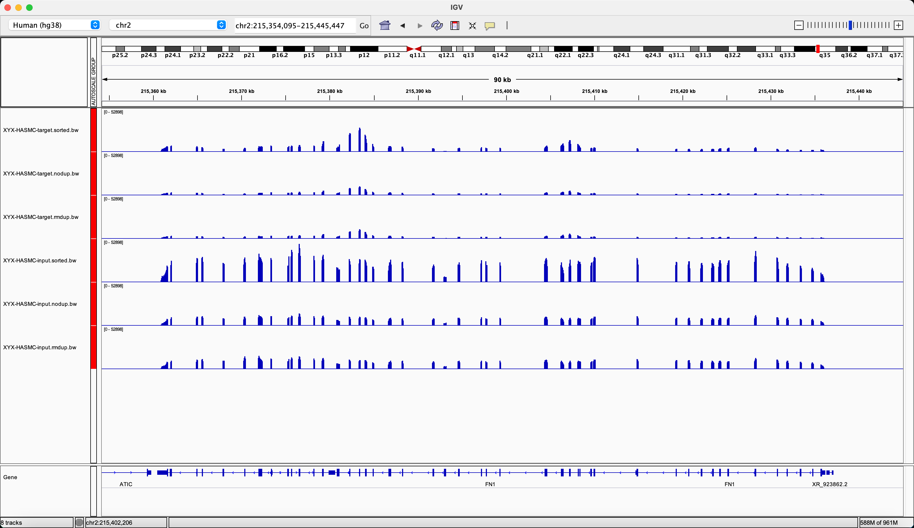
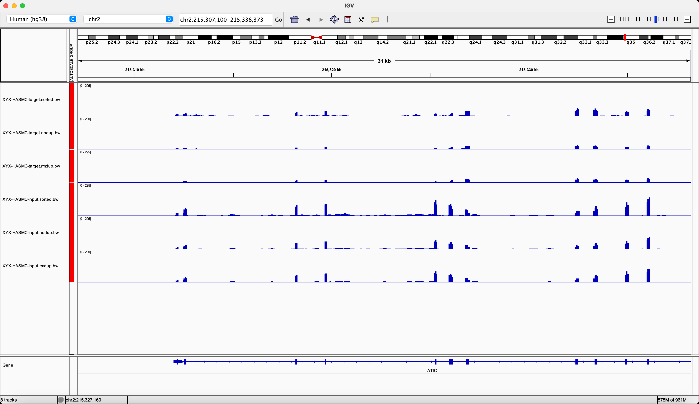
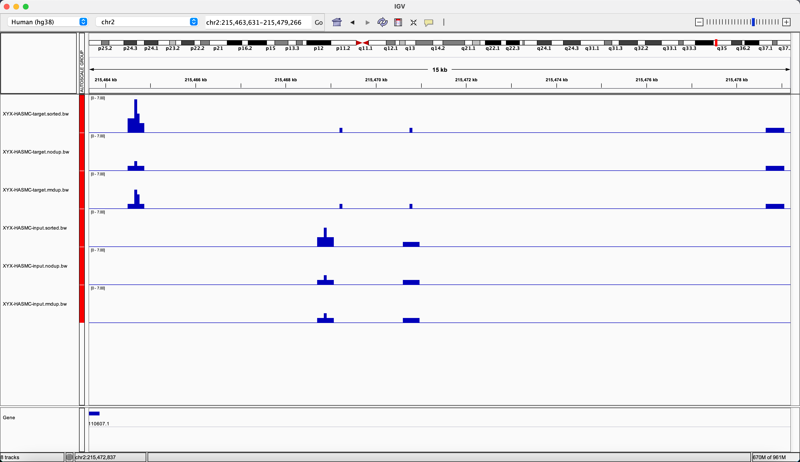

# picard 和 sambamba 去重原理和区别

想要对比测试一下，先放着代码在这里，日后再来研究

```bash
# 这个 rmdup 似乎特别狠

ln -s ${merge_bam} ${merge_bam_name}.filt.bam

which picard.jar
which picard
java -Xmx4G -XX:ParallelGCThreads=1 -jar \
    /xxx/share/picard-2.20.7-0/picard.jar \
    MarkDuplicates \
    INPUT=${merge_bam_name}.filt.bam \
    OUTPUT=${merge_bam_name}.dupmark.bam \
    METRICS_FILE=${merge_bam_name}.dup.qc \
    VALIDATION_STRINGENCY=LENIENT \
    USE_JDK_DEFLATER=TRUE \
    USE_JDK_INFLATER=TRUE \
    ASSUME_SORTED=true \
    REMOVE_DUPLICATES=false

samtools view -@ 10 -F 1804 -f 2 -b ${merge_bam_name}.dupmark.bam > ${merge_bam_name}.nodup.bam
samtools index ${merge_bam_name}.dupmark.bam
samtools index ${merge_bam_name}.nodup.bam
samtools sort -n ${merge_bam_name}.nodup.bam -T ${merge_bam_name}.nodup.tmp -O sam | SAMstats --sorted_sam_file - --outf ${merge_bam_name}.nodup.samstats.qc
samtools sort -n ${merge_bam_name}.dupmark.bam -o ${merge_bam_name}.dupmark.nmsrt.bam -T ${merge_bam_name}.dupmark -@ 10
bedtools bamtobed -bedpe -i ${merge_bam_name}.dupmark.nmsrt.bam | awk 'BEGIN{OFS="\t"}{print $1,$2,$4,$6,$9,$10}' | grep -v "^chrM\s" | sort | uniq -c | awk 'BEGIN{mt=0;m0=0;m1=0;m2=0} ($1==1){m1=m1+1} ($1==2){m2=m2+1} {m0=m0+1} {mt=mt+$1} END{m1_m2=-1.0; if(m2>0) m1_m2=m1/m2; m0_mt=0; if (mt>0) m0_mt=m0/mt; m1_m0=0; if (m0>0) m1_m0=m1/m0; printf "%d\t%d\t%d\t%d\t%f\t%f\t%f\n",mt,m0,m1,m2,m0_mt,m1_m0,m1_m2}' > ${merge_bam_name}.dupmark.lib_complexity.qc
rm -f ${merge_bam_name}.dupmark.nmsrt.bam

# 4619483435      4.302G  XYX-HASMC-input.bam
# 1530064175      1.425G  XYX-HASMC-input.nodup.bam
# 16707376395     15.560G XYX-HASMC-target.bam
# 1119010982      1.042G  XYX-HASMC-target.nodup.bam
```


```bash
# -r 为去除重复
sambamba markdup -t 10  --tmpdir='./'  -r ${rawbam}  ${rawbam%.bam}.rmdup.bam &>log.${rawbam%.bam}.txt
# 4619483435      4.302G  XYX-HASMC-input.bam
# 3916343709      3.647G  XYX-HASMC-input.rmdup.bam
# 16707376395     15.560G XYX-HASMC-target.bam
# 13298952011     12.386G XYX-HASMC-target.rmdup.bam
```

bw对比：
```bash
# raw:
# 41067703        39.165M 01.hisat/XYX-HASMC-target.sorted.bw
# 53376435        50.904M 01.hisat/XYX-HASMC-input.sorted.bw
# picard:
# 35599113        33.950M rmdup1/XYX-HASMC-target.nodup.bw
# 47246860        45.058M rmdup1/XYX-HASMC-input.nodup.bw
# sambamba:
# 38194459        36.425M rmdup2/XYX-HASMC-target.rmdup.bw
# 50439175        48.103M rmdup2/XYX-HASMC-input.rmdup.bw
```

# IGV里面的表现

确实删掉了很多重复的reads

  

  

  

  

---
但是，也有一部分reads，是直接去除掉了。  
需要验证是什么原因：
1. 有可能去除了次级比对结果
2. 有可能去除了reads质量不高的结果
3. 有可能按比对得分去除，比如 MapQ

  


## 去重原理深究

> 关于重复序列，我认为其来源主要是PCR扩增，也称PCR duplication。关于这一点，黄树嘉老师的从零开始完整学习全基因组测序写的非常详细，我这里截取一段。具体的可以看黄老师的文章从零开始完整学习全基因组测序（WGS）数据分析：第4节 构建WGS主流程
>
> 我们在第1节中已经知道，在NGS测序之前都需要先构建测序文库：通过物理（超声）打断或者化学试剂（酶切）切断原始的DNA序列，然后选择特定长度范围的序列去进行PCR扩增并上机测序。
> 
> 因此，这里重复序列的来源实际上就是由PCR过程中所引入的。因为所谓的PCR扩增就是把原来的一段DNA序列复制多次。可是为什么需要PCR扩增呢？如果没有扩增不就可以省略这一步了吗？
> 
> 情况确实如此，但是很多时候我们构建测序文库时能用的细胞量并不会非常充足，而且在打断的步骤中也会引起部分DNA的降解，这两点会使整体或者局部的DNA浓度过低，这时如果直接从这个溶液中取样去测序就很可能漏掉原本基因组上的一些DNA片段，导致测序不全。而PCR扩增的作用就是为了把这些微弱的DNA多复制几倍乃至几十倍，以便增大它们在溶液中分布的密度，使得能够在取样时被获取到。所以这里大家需要记住一个重点，PCR扩增原本的目的是为了增大微弱DNA序列片段的密度，但由于整个反应都在一个试管中进行，因此其他一些密度并不低的DNA片段也会被同步放大，那么这时在取样去上机测序的时候，这些DNA片段就很可能会被重复取到相同的几条去进行测序
> 
> ...
> 补充一句，其实他还少做2件事情：
>
> 第一：不同标记重复工具的标记规则
>
> 第二：比较不同工具在标记重复上的差异，当然从上面的结中，我们可以发现sambamba和picard工具是等效的，且速度更快，而且严格于samtools，samblaster。换句话说，如果你的流程中出现了picard，放心大胆的用sambamba替代。
>
> —— [去重工具到底哪家强](https://mp.weixin.qq.com/s?src=11&timestamp=1636337619&ver=3423&signature=gSsglzgzG00HIzKWL4BWWYmq5lU*yY770QeGERgpLOsPHAHIHAaoibqjdm9yYg*UTKs9UqngdEsp0xLnGWYwGnINFhiBh88QhTtB8IwvqvbUksjZ5QDSOBlyvuwo0Ac2&new=1)


### 挑选maped_reads 和 去重 两者顺序调换对结果会有影响吗？

答案： 无影响

```bash
sambamba markdup -t 10  --tmpdir='./tmp'  -r $name.bam  $name.rmdup.bam &>logs/log.sambamba-markdup.$name.txt
samtools view -F 4 -b $name.rmdup.bam >$name.rmdup.maped.bam

samtools view -F 4 -b $name.bam >$name.maped.bam
sambamba markdup -t 10  --tmpdir='./tmp'  -r $name.maped.bam  $name.maped.rmdup.bam &>logs/log.sambamba-markdup.$name.maped.txt
```

```tsv
Sample	total_passed	mapped_passed	mapped_passed_pct	properly paired_passed	properly paired_passed_pct	paired in sequencing_passed	mapped_reads	%mapped_reads
Bend.3-input-lncRNA.sorted.rmdup.flagstat.txt	74830257	32112855	42.91	2220246	4.92	45159660	2442258	5.40805%
Bend.3-input-lncRNA.sorted.rmdup.maped.flagstat.txt	32112855	32112855	100.0	2220246	90.91	2442258	2442258	100%
Bend.3-input-lncRNA.sorted.maped.rmdup.flagstat.txt	32112855	32112855	100.0	2220246	90.91	2442258	2442258	100%
Bend.3-target-lncRNA.sorted.rmdup.flagstat.txt	44856887	5182520	11.55	390488	0.97	40167344	492977	1.22731%
Bend.3-target-lncRNA.sorted.rmdup.maped.flagstat.txt	5182520	5182520	100.0	390488	79.21	492977	492977	100%
Bend.3-target-lncRNA.sorted.maped.rmdup.flagstat.txt	5182520	5182520	100.0	390488	79.21	492977	492977	100%
```
