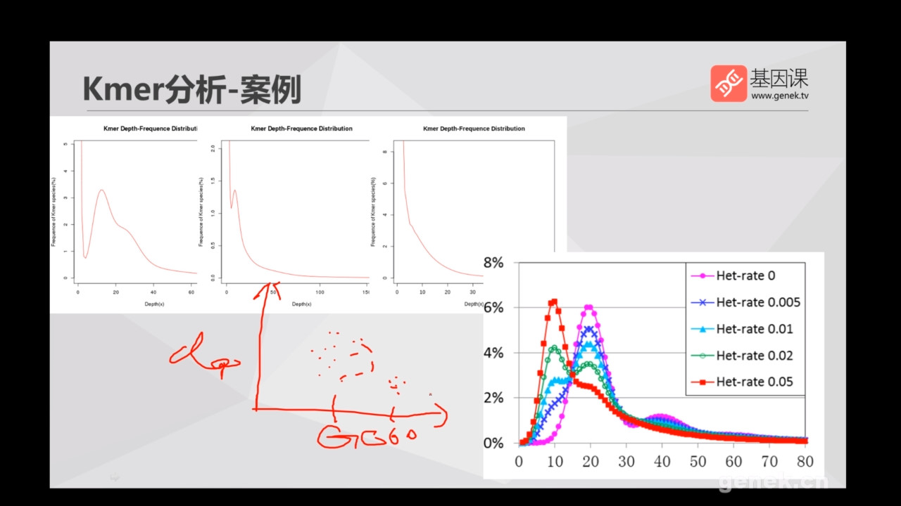

# 质控

...

# Kmer分析

通常取k=17, 可以覆盖全基因组

[图]()

[公式]？

Kmer深度与碱基深度的关系？？？

## Kmer分析基因组大小

步骤：


注意事项：

二代测序，需要取错误率1%以下的？？？

### 实例：

## Kmer分析-杂合度

K-mer可分为两类：
- 杂合Kmer
- 纯合Kmer

杂合率公式如何理解？？

L：150bp

## Kmer分析的软件

软件：
- Jellyfish - 消耗资源较少（推荐）
- GCE - 特点是杂合估计，杂合率计算
- GenomeScope - V2.0预测几倍体（）

分析图中，峰、拖尾的理解？c/2、c、2c是什么？

### 实例：Kmer常见峰图的理解


注意：
- 如果数据有污染，结果完全不能用。杂合率，重复率所有数据都是不可信的。
- 主峰没有明显的判断标准，并非一定是最高的峰  
  可以结合流式细胞仪实验？？
- 并非一定用k=17
  - 太低，无法覆盖到全基因组。选取Kmer要求要大于基因组
    - 20G基因组，k=25，4^25
  - 太高，无法保证有效率


预估基因组大小？可以查阅，*30-50得到测序量

流式大小（是用其他物种做参照，不一定准），和预估基因组大小差异不大。

拼接结果一般不要大于估计基因组大小。

做人k=17，k=19

---

我们想拼接的是一套基因组。比如人46条染色体，我们得到的是23条那一套。

GC-dep图？


杂合度高增加测序深度？

三倍体就是一个理想的峰。

1/2处有峰，可以判断是偶数倍型。

同一物种杂合度有差异，比如拟南芥F1测序和后面是不一样的。


---
# 软件实操

## jellyfish
```bash
pre=kmer_19
# 计算生成二进制文件
jellyfish count \
    -t 4 \
    -C \
    -m 19 \  # kmer大小
    -s 1G \  # 
    -g generate \  # 解压方式
    -G 2  \ # 解压线程数，只解压两个文件
    -o $pre  # 输出文件

# 计算kmer频数表
jellyfish histo \
    -v \ # 生成日志
    -o $pre.histo
    $pre
    -t 4
    -h 10000 \ # ???

# 统计
jellyfish stats $pre -o $pre.stats
```

## gce

```bash
gce -f Kmer_19.histo
```

## GenomeScope

V1.0 只能做二倍体。

V2.0 可以指定倍型。

V2.0有发布两个软件，同期s开头软件可以预测多倍体

估计的基因组大小一般要偏小。作者认为重复不应该参与计算，还有会进行kmer截断。

# 问题解答

一般不用关注细胞器的基因带来的影响，除非基因组很小。

GCE可能更接近于真实。

# 质控数据判断 FastQC

FastQC


另一张图

GC-reads图 为何有污染数据就不平滑？
GC-dep图 为何有污染会出现另一团？

# 附

网站：
- c-velue大小网站：
  - 植物
  - 动物

实时更新植物基因组大小：
