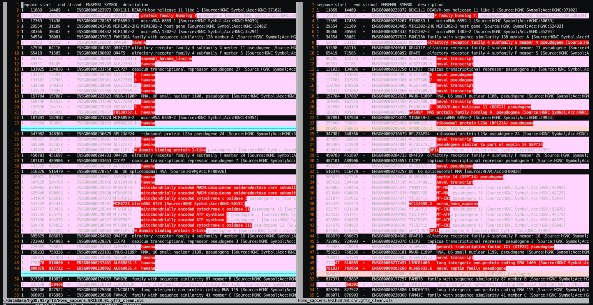

# 基因组

GENCODE 版本历史 - [GENCODE - The Human GENCODE Release History](https://www.gencodegenes.org/human/releases.html)

# 注释信息

`ENSEMBL` 与 `SYMBOL` 在不同版本中的对应关系不一样。

一般来说，【这样理解对吗？】
- `ENSEMBL` 基本不会变，它表述的是基因在基因组上的位置关系。
- `SYMBOL` 可以理解为在这段区域上的注释信息，可随着研究深入更迭，不断发生变化。

不同版本差异很大：

> 比如说这个 91 vs 98 的表：
> 
>   
> 
> - 第8行到20行，基因描述信息更新
> - 第21、38、49行，基因名更换
> - 第51行，基因增加
> - 第53行，基因位置信息，结束位置更新