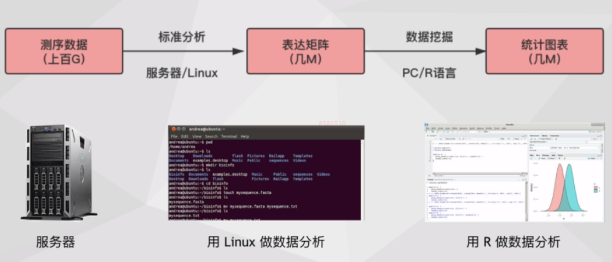
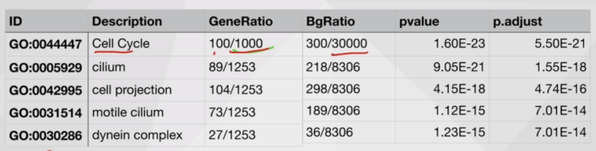

转录组

RNA-seq

如何理解？

它是一种结果，

# 转录组分析流程

测序结果进行标准分析，获得表达矩阵，使用R语言进行

> R语言优势：
> - Bioconductor一个现成的生信R仓库包，一个拥有几十年的成熟社区的
如：以下图

complexheatmap直接作出以下图：

箱型图：加上p-vanel

heatmap

WGCNA

生存分析

正选择分析

PCA

# 表达矩阵数据的获取
## 表达芯片

基于探针捕获技术

缺陷：

比如肿瘤中融合基因。

## RNA-seq

## GEO数据库

---

# 数据挖掘
## 数据
- 表达矩阵
- 样本信息表（临床信息、表型特征、生化指标等）
- 基因信息表

大多数研究的目的：找到表型变化背后的分子机制。

# 常见数据挖掘分析
## 差异表达分析
哪些基因在两组样本中有明显差异表达？

图

Chromo...？
FC？
Pval？
Padj？

---
问题：
- 一般做几个生物学重复？
要得到准确结论，至少3个，最好7~8个生物学重复。

---
差异表达：几个问题
1. 如何筛选差异基因？
    Padj < 0.05
2. 是否生物学重复越多，鉴定到的差异基因就越多？
    是。原理图解
      

3. 200和2000如何选

## 差异表达：结果可视化

火山图，热图？

如何看？

## 富集基因
差异基因是否显著集中在某个功能分类上？

  

GO分类，功能分类

Pathway分类，

### 

柱状图

点图

软件包

## 样本聚类分析
探索样本之间的关系，锁定关键样本

？探索

## 相关系数
用来描述样本表达模式的相似程度

样本之间

基因之间
（基因与宫颈癌）

> 相关系数：三种常用的计算方法
> ...

## 聚类分析 和 WGCNA
探索基因与表型的关系

### 聚类

相关系数计算相似性

### WGCNA
（加权。。。共表达。。。）

1. 基因模块构建
2. 
3. 绘制网络图 cytoscope软件包

不应该是随机网络而应该是无标度网络

进行了相关性矩阵进行优化，

