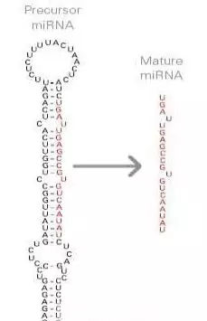

# miRNA分析的理解

---
miRNA被RNA聚合酶II和III转录，生成前体，这些前体经历一系列裂解事件以形成成熟的miRNA。随后与即将表达的mRNA的一些位点结合，使得阻碍肽链的生成，进而影响蛋白及其具有功能的结构生成。

从一定程度上，我们分析就是寻找正常细胞和异常细胞中，miRNA和mRNA的表达差异。

通过miRNA的表达差异分析结果，找出对应的miRNA，再去预测对应的靶基因。 同时对mRNA表现出差异筛选出对应的基因。

基于miRNA预测的靶基因和mRNA差异分析的基因，两者取一个交集，便可从理论上得出是什么miRNA影响并调控着对应的基因。

这算一个节点完成。

***这个过程中需要思考的问题***  
1. 如何保证我们的miRNA的reads和参考基因组比对上的序列就是miRNA区域序列？
   - 2020-BMC论文中，通过双重去除。通过`blastall`识别和去除rRNA，scRNA，snoRNA，snRNA和tRNA。通过`bowtie`比对上exons, introns, and repeat sequences were removed.
   - 2018-biorxiv论文中，采用注释的方法直接找出对应的miRNA区域，对未注释到的直接进行新miRNA预测。如软件miRge 2.0，通过各种搜索库对reads添加注释，包括成熟的miRNA，miRNA发夹，mRNA，tRNA，snoRNA，rRNA，其他非编码RNA和（可选）已知的RNA插入序列（27,28）。
2. 如何进行miRNA的靶基因预测，原理是什么？
   - 2020-BMC论文中，通过`Mireap_v0.2`进行发夹RNA判断，预测miRNA？
   - 通过[网络搜集资源](https://mp.weixin.qq.com/s/smntpfpeLqzhnykfd5IJpg)。这些数据库一般是通过预测miRNA种子区与mRNA的结合情况来预测靶基因。主要遵循以下几个基本原则：
     - miRNA 与其靶位点的互补性；
     - miRNA 靶位点在不同物种之间的保守性；
     - miRNA-mRNA 双链之间的热稳定性；
     - miRNA 靶位点处不应有复杂的二级结构等。

***疑惑：***
- 【1. 造成miRNA差异表达的根本原因又是什么呢？】

---
**miRNA分析流程探索，与钱总交流所得的大体思路**

上游：
> fastq --> bam --> all_id  
> 关键点在于GTF（hisat2要用短的仅几十bp的miRNA的gtf，不能用mRNA；bomwa比对也要用到；）  

下游：
> 联合分析，从两个样本里面进行联合分析miRNA, mRNA, 取差异还是交集？  

---
- [x] 问题1：只在人的总的gtf信息中找到了miRNA的部分gtf，在进行后续使用，是需要单独提取出来吗？有没有可能存在单独的gtf，目前还没有找到，假设存在，该怎么去寻找？已解决

# miRNA相关分析流程整理
## 资料搜集

### 2016-Nature-Scientific_Reports

> 简要地说，将原始读段置于Illumina管线过滤器（Solexa 0.3）中，然后使用内部程序ACGT101-miR（美国德克萨斯州休斯顿的LC Sciences）进一步处理该数据集，以除去衔接子二聚体，垃圾，低复杂度，常见RNA家族（rRNA，tRNA，snRNA，snoRNA）和重复序列。  

### 2018-SpringLink:   
  [Bioinformatic Analysis of MicroRNA Sequencing Data | SpringerLink](https://kami.app/Nr0lRgAOmSMd)   
  > rawlink：[[>>>]](https://link.springer.com/protocol/10.1007%2F978-1-4939-7710-9_8)  
  > 特点：  
  > 使用 mirpro 进行mapping，readscount  
  > 【已测试，软件非主流，数据未跑通】  

### 2017-BMC:  
  [QuickMIRSeq: a pipeline for quick and accurate quantification of both known miRNAs and isomiRs by jointly processing multiple samples from microRNA sequencing.](https://bmcbioinformatics.biomedcentral.com/articles/10.1186/s12859-017-1601-4)  

文章总结：

> **step1: 数据准备**
> 
> - **miRNAs** : 
> - **hairpins** : 用作后面进行mapping的参考文件。【fasta？】
> - **samples reads** : 测序数据。数据处理：去接头，质控，去重(处理得到unique reads) 【疑惑，进行这个数据分析为什么需要去重？这是必须的吗？】
> 
> **step2: 比对**
> 
> 接下来，将unique reads 进行 maping 到步骤1中准备的miRNA, hairpin, small RNA, and mRNA sequence databases。
> 
> 将与参考基因组不匹配的miRNA的reads重新mapping，以减少假命中（图3c），并考虑到链信息以获得更准确的读图（图3d和e）。
> 

### 2019-Research
[Large-scale Circulating microRNA Profiling for the Liquid Biopsy of Prostate Cancer. ](https://kami.app/sT9ELUEv52P4)  
用于前列腺癌液体活检的大规模循环microRNA分析。

### 2018-nature 2018-bioRxiv:

[xMD-miRNA-seq to generate near in vivo miRNA expression estimates in colon epithelial cells | Scientific Reports](https://www.nature.com/articles/s41598-018-28198-z#Sec10)  
xMD-miRNA-seq在结肠上皮细胞中产生近体内miRNA表达估计 科学报告

[miRge 2.0: An updated tool to comprehensively analyze microRNA sequencing data](https://www.biorxiv.org/content/10.1101/250779v1.full)  
miRge 2.0：一种全面分析microRNA测序数据的更新工具| 生物受体

> 疑惑，使用的软件为 Bowtie v1.1.1 ，版本较老，有问题吗？  
> 没有问题，Bowtie很适合50bp以下的短序列比对。[[ 参考来源 ]](https://blog.csdn.net/weixin_41481113/article/details/83824640)

### 2020-BMC：  
[Immune-related miRNA-mRNA regulation network in the livers of DHAV-3-infected ducklings | BMC Genomics | Full Text](https://bmcgenomics.biomedcentral.com/articles/10.1186/s12864-020-6539-7)  
DHAV-3感染小鸭肝脏中的免疫相关miRNA-mRNA调控网络|BMC基因组学|全文

### 维基百科

> Central to miRNA-seq data analysis is the ability to
> - 1) obtain miRNA abundance levels from sequence reads, 
> - 2) discover novel miRNAs and then be able to
> - 3) determine the differentially expressed miRNA and their
> - 4) associated mRNA gene targets.
> 
> ——[维基百科](https://en.wikipedia.org/wiki/MicroRNA_sequencing)
> 
> - miRNA比对、定量
> - 新型miRNA发现
> - 差异表达分析
> - 靶基因预测

### 其他

- [RNA-seq与miRNA-seq联合分析_wangyunpeng_bio的博客-CSDN博客](https://blog.csdn.net/qq_29300341/article/details/74134083)  
  该文章给出了miRNA和mRNA下载数据
- [miRNA的特征、功能及识别方法等详解_高锦的博客-CSDN博客](https://blog.csdn.net/herokoking/article/details/77863126)  
  该文章总结了大量的靶基因预测方法
- [优化miRNA-seq数据预处理](https://www.ncbi.nlm.nih.gov/pmc/articles/PMC4652620/)
  该文中给出了不同软件对比的参数，

# 我的小结
## 数据准备
miRNAs_reads.fq.gz  <- fastq.gz
hairpins.fa
mature.fa

---
其他（未下载）：
- 直接获取表达矩阵  
  TCGA下载和提取miRNA表达数据-生信自学网  
  https://www.biowolf.cn/TCGA/26.html

- 小RNA测序分析数据下载miRNA、siRNA和piRNA-生信自学网  
  https://www.biowolf.cn/m/view.php?aid=205
  > 其他有用信息，分析流程：
  > - 一、数据下载
  > - 二、质控  对得到的数据质量控制，做数据过滤
  > - 三、reads长度分布统计
  > - 四、全基因组比对
  > - 五、已知miRNA鉴定
  > - 六、Rfam数据比对
  > - 七、差异表达
  > - 八、miRNA靶基因
  > - 九、新miRNA预测
  > - 十、其他分析

## 比对

【弄清楚一个问题，micRNA是怎么测序的？如果没有按多少长度打断的方法测序，为何要用基于sp算法的比对软件(如hisat)做呢，这本身就可能带来问题】

- BWA-aln
该工具将单个reads与miRBase v21和UCSC中的序列特征注释进行比较。但是，该工具仅注释与miRBase中已知miRNA完全匹配的那些读段，因此不应将其用于新颖的miRNA鉴定或错配比对。  
https://docs.gdc.cancer.gov/Data/Bioinformatics_Pipelines/miRNA_Pipeline/

- Bowtie
使用 Bowtie 算法对齐读取，该算法最适合短而高质量的读取。  
https://documentation.partek.com/display/FLOWDOC/User+Guide%3A+MicroRNA+Pipeline

- STAR
【该软件比较小众，靠谱吗？】  
直接使用该软件进行**比对**和**定量**  
microRNA-seq Data Standards and Processing Pipeline – ENCODE  
https://www.encodeproject.org/microrna/microrna-seq/

## 定量

## 新miRNA预测

使用MIREAP_v0.2软件，在模拟感染和DHAV-3感染的小鸭肝脏文库中预测了总共109和34个新的miRNA。[click -->](https://bmcgenomics.biomedcentral.com/articles/10.1186/s12864-020-6539-7)

## miRNA的差异表达分析
differentially expressed miRNAs (DEMs)

# miRNA 下游分析流程

micRNA分析流程：
- miRNA数据下载
- miRNA数据整理
- miRNA差异分析、热图、火山图
- miRNA转录因子预测
- miRNA的GO富集分析
- miRNA靶基因预测
- mRNA数据下载
- mRNA数据整理
- mRNA差异分析、热图、火山图
- miRNA靶基因和差异mRNA取交集
- 调控网络构建
- GO和KEGG富集分析

---
我的疑惑：
- [X] 我在网上看到有的分析方法需要用到bowtie进行比对等操作，为什么这个流程不需要？ [2020-06-10_T3]  
  **思考：** 查看了这个数据的来源文章，数据是一个规则的表达矩阵，但数据的来源却是基于芯片的信号值，而非RNA-seq的count方法，因而谈不上像RNA-seq中的标准定量方法了。

## miRNA芯片数据下载
NCBI-GEO

Home - GEO - NCBI  
https://www.ncbi.nlm.nih.gov/geo/

## miRNA数据整理

Id转换

数据分组

## miRNA差异分析、热图、火山图

miRNA差异分析

miRNA热图

miRNA火山图

miRNA的TF富集分析

## miRNA转录因子预测

## miRNA的GO富集分析

## miRNA靶基因预测

## mRNA数据下载
mRNA芯片数据下载

## mRNA数据整理

## mRNA差异分析、热图、火山图

## miRNA靶基因和差异mRNA取交集

## 调控网络构建

## GO和KEGG富集分析

# miRNA相关资料整理

google学术关键词：

mirna analysis

## 论文1
【待吸收】
Genome-Wide miRNA Analysis Identifies miR-188-3p as a Novel Prognostic Marker and Molecular Factor Involved in Colorectal Carcinogenesis | Clinical Cancer Research  
https://clincancerres.aacrjournals.org/content/23/5/1323.full

## 论文2
内容提取
- 新型miRNA预测的工具
  - miRDeep和miRDeep star [6]

compilation of Web-based research tools for miRNA analysis | Briefings in Functional Genomics | Oxford Academic  
https://academic.oup.com/bfg/article/16/5/249/3053315

# micRNA简介

【待读文章网站】：  
miRNA的生物发生-技术专题(停用)-广州赛诚生物科技有限公司-服务于您的核心利益！  
http://www.gzscbio.com/tech/76/  

网络资料搜寻：
## miRNA的基本概念
miRNA (microRNA)是一组由基因组编码的长度约 20～23 个核苷酸的非编码 RNA，通过和靶基因 mRNA 碱基配对引导沉默复合体 (RISC) 降解 mRNA 或阻碍其翻译。在 miRNA 公共数据库 miRBase (http://www.mirbase.org/)中已经有 1W 多条来自不同物种的 miRNA 序列 [^1]。

## 研究micRNA的意义：
- 有研究表明，micRNA的差异表达与某些癌症的发生有关，可以作为标志物检测。

## miRNA命名规则

物种-microRNA类别-序号

命名包含三部分内容，即物种，microRNA类别，序号。三者间用短线连接。
1. 物种一般用三个小写字母表示，如hsa,mmu和rno分别代表人，小鼠和大鼠。
2. MicroRNA类别 是指所命名的microRNA是pre-miRNA还是mature miRNA。
   - pre-miRNA 用 mir 表示，
   - mature miRNA 用 miR 表示。
3. 序号为一阿拉伯数字，代表microRNA发现的先后。一般而言，数字越小，发现越早。

示例：
- hsa-mir-7-1, hsa-mir-7-2, hsa-mir-7-3

---
注：
- 有些pre-miRNA可以产生两个mature miRNA。对应pre-miRNA茎环结构5' 和3' 序
列的mature miRNA分别加后缀-5p和-3p以示区分，如hsa-miR-769-5p和hsa-miR-
769-3p。

## miRNA的产生过程

那它是怎么来的呢？ [^1]

是由约 70 个碱基大小形成发夹结构的单链 RNA 前体 （pre-miRNA），经过 Dicer 酶酶切加工后，成为长约 20~24nt 的成熟 miRNA，如下图所示：  
  

### 3p还是5p，有必要区分吗？

有的 miRNA 前体两个臂分别产生一条有功能的成熟 miRNA，他们分别靶向不同的位点。这时候就要来进行区分了，一般以 “-5p” 和“-3p”分别命名。如 hsa-miR-21-5p 和 hsa-miR-21-3p，分别表明从 hsa-mir-21 前体的 5’端臂和 3’端臂加工而来的。表达水平较高的 miRNA 后面不加任何符号，而表达水平较低的 miRNA 后面加上 * 号，如 hsa-miR-21*, 有时带 “*” 的 miRNA 就根本不出现。

而发夹状结构的 miRNA 前体转录本以 “mir” 命名，其编号以 “MI” 编号，如人的 miRNA 21 的前体 ID 为 hsa-mir-21，Accession 为 MI0000077。如下图所示。

### 3p/5p 功能不一样

看到发表在19 July 2019的文章Strand-specific miR-28-3p and miR-28-5p have differential effects on nasopharyngeal cancer cells proliferation, apoptosis, migration and invasion，全文提供实验验证了miR-28-3p and miR-28-5p的生物学功能不一样。

但是我们作为数据分析人员，很难有这么复杂的背景知识，有时候仅仅是把表达矩阵给过滤，大家都懂的过滤操作。

In some cases, two mature miRNAs can be excised from the same stem-loop pre-miRNA

These "5p" and "3p" miRNAs are biologically different in terms of stability and functionality. In humans, two mature miRNAs, miR-28-3p and miR-28-5p, are derived from 3′ and 5′ ends of pre-miR-28, respectively. miR-28-3p and miR-28-5p targets several cancer-related genes and is hence involved in cell proliferation, migration, invasion and epithelial–mesenchymal transition (EMT)

作者：生信技能树
链接：https://www.jianshu.com/p/e1686a147ea9
来源：简书
著作权归作者所有。商业转载请联系作者获得授权，非商业转载请注明出处。

## miRNA数据库

- mirbase : http://www.mirbase.org/
- GEO : https://www.ncbi.nlm.nih.gov/geo/query/acc.cgi?

如何查miR-224的序列,首先要用到miRbase这个数据库(http://www.mirbase.org/),mirbase数据库是做miRNA研究最“经典”的数据库 [^2]。

---

[^1]: ——参考：你问我答 | miRNA的5p和3p  
https://www.sohu.com/a/226493148_464200

[^2]: 3p还是5p，有必要区分吗？  
http://www.360doc.com/content/18/0312/22/46316053_736493196.shtml
