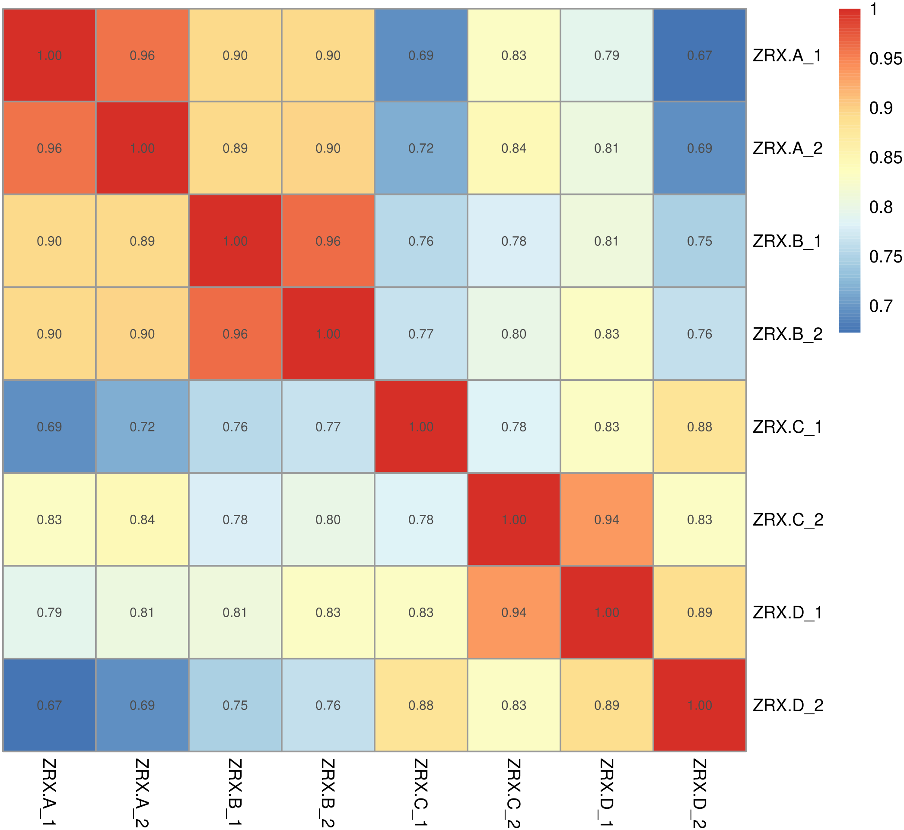
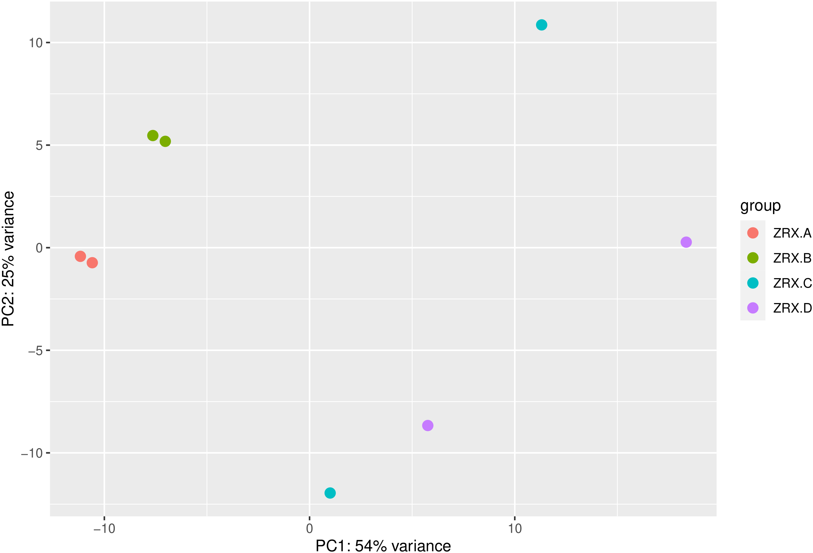
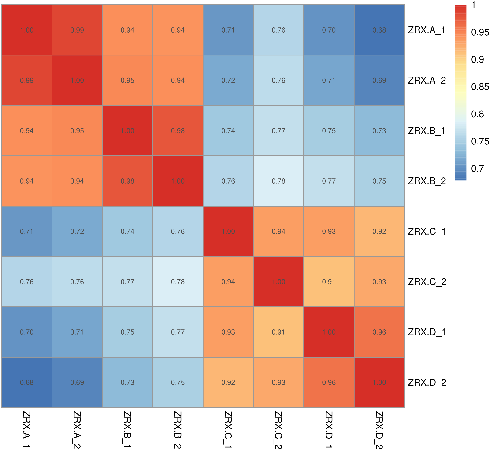
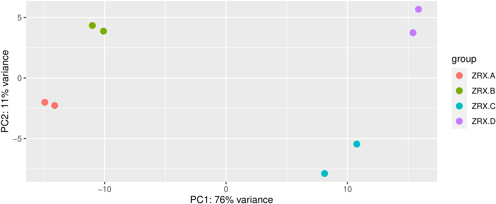

sva包

<table>
<tr>  <td><p>images/Batch-effect-correction1.1.png</p></td>  <td><p>images/Batch-effect-correction1.2.png</p></td></tr>
<tr>  <td><p>images/Batch-effect-correction2.1.png</p></td>  <td><p>images/Batch-effect-correction2.2.png</p></td></tr>
</table>


代码：

```R
# 功能：该脚本用于纠正批次效应。
# 环境: R 4.0.3

# in:  all.id.xls2
# out: all.id.xls
# 注：需要手动修改代码调整批次关系组别

rm(list = ls()) # 清空环境变量
options(stringsAsFactors = F) ## 字符不作为因子读入
options(BioC_mirror = "https://mirrors.tuna.tsinghua.edu.cn/bioconductor/")

if (!requireNamespace("sva", quietly = TRUE)) BiocManager::install("sva", update = F, ask = F)

################################
# 测试数据
################################
library(sva)
count_matrix <- matrix(rnbinom(400, size = 10, prob = 0.1), nrow = 50, ncol = 8)
batch <- c(rep(1, 4), rep(2, 4))
adjusted <- ComBat_seq(count_matrix, batch = batch, group = NULL)

################################
# 自己的数据分析
################################
a <- read.table("./all.id.xls2", header = T, stringsAsFactors = F, sep = "\t", row.names = 1)
head(a)
colnames(a) # "ZGW-CON_1", "ZGW-CON_2", "ZGW-CON_3", "ZGW-TREAT_1", "ZGW-TREAT_2", "ZGW-TREAT_3"
group_list_relation <- unlist(lapply(
    strsplit(as.character(colnames(a)), "[_]"),
    function(x) {
        paste(unlist(x[-length(x)]), collapse = "_")
    }
))
group_list_relation # "ZGW-CON"   "ZGW-CON"   "ZGW-CON"   "ZGW-TREAT" "ZGW-TREAT" "ZGW-TREAT"
group_list <- unique(group_list_relation) # ??使用factor会使得组名自动排序，不利于后面输入deseq2谁和谁比较
# group_list <- factor(group_list1)
group_list # "ZGW-CON"   "ZGW-TREAT"
## colData用于存放样本信息数据
coldata <- data.frame(row.names = colnames(a), id = colnames(a), groups = group_list_relation)
coldata

library(sva)
alldata <- a
head(a)
# 定义批次信息
batch <- c(1, 1, 1, 1, 1, 2, 2, 1)
batch
group <- coldata$groups
group

# Batch effect adjustment
adjusted_counts <- sva::ComBat_seq(as.matrix(alldata), batch = batch, group = group)
head(alldata)
head(adjusted_counts)

write.table(cbind(GeneID = rownames(adjusted_counts), adjusted_counts), "./all.id.xls", sep = "\t", quote = F, row.names = F)
```


结果示例文件：

```bash
$ head all.id.xls*
==> all.id.xls <==
GeneID  ZRX.A_1 ZRX.A_2 ZRX.B_1 ZRX.B_2 ZRX.C_1 ZRX.C_2 ZRX.D_1 ZRX.D_2
ENSG00000186092 0       0       0       0       2       0       0       0
ENSG00000284733 0       0       0       0       0       0       0       0
ENSG00000284662 0       0       0       0       0       0       0       0
ENSG00000187634 268     350     121     151     203     85      80      28
ENSG00000188976 633     944     680     980     1339    1508    1950    2286
ENSG00000187961 128     180     116     103     87      126     114     169
ENSG00000187583 108     99      64      92      51      61      76      90
ENSG00000187642 45      73      46      32      22      28      28      38
ENSG00000188290 0       0       0       0       1       0       0       0

==> all.id.xls2 <==
Geneid  ZRX.A_1 ZRX.A_2 ZRX.B_1 ZRX.B_2 ZRX.C_1 ZRX.C_2 ZRX.D_1 ZRX.D_2
ENSG00000186092 0       0       0       0       2       0       0       0
ENSG00000284733 0       0       0       0       0       0       0       0
ENSG00000284662 0       0       0       0       0       0       0       0
ENSG00000187634 277     350     124     152     189     63      85      32
ENSG00000188976 713     956     765     994     1447    1288    1579    2405
ENSG00000187961 123     164     103     101     85      161     131     152
ENSG00000187583 89      84      54      76      43      103     128     75
ENSG00000187642 35      61      39      24      17      49      52      31
ENSG00000188290 0       0       0       0       1       0       0       0
```